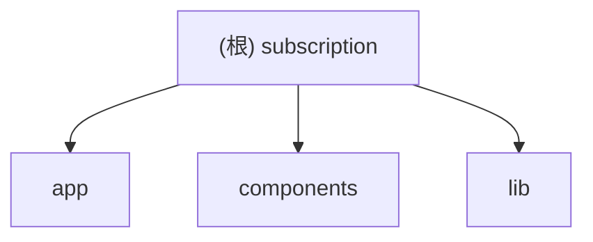

# CLAUDE.md — subscription 项目约定

## 变更记录 (Changelog)
- 2026-03-26 09:45:22 CST：执行自适应初始化（根级简明 + 模块级详尽），补充架构总览、模块索引、运行开发规范、测试与质量策略，并建立模块导航。

## 项目愿景
subscription 是一个面向 FishXCode AI 的订阅与账户前台站点，目标是以统一入口承接套餐展示、登录注册、账户控制台与基础会话管理能力，并与外部 new-api 用户与订阅数据联动。

## 架构总览
- 框架：Next.js App Router（TypeScript）
- UI：React 19 + Tailwind CSS + 自定义 UI 组件（`components/ui`）
- 认证：邮箱/用户ID 登录、注册、Redis Session
- 数据：PostgreSQL（本地 users）+ 可选 external new-api PostgreSQL（账户/订阅/订单）
- i18n：内置字典（`zh`/`en`），基于路由段 `[locale]`
- SEO：Metadata API + sitemap + robots

## 模块结构图（Mermaid）

## 模块索引
| 模块 | 职责 | 入口/关键点 | 测试情况 | 配置情况 |
|---|---|---|---|---|
| `app/` | 页面路由、API Route、SEO 元数据与页面编排 | `app/layout.tsx`, `app/[locale]/layout.tsx`, `app/api/auth/*` | 未发现测试目录 | 依赖根配置 |
| `components/` | 站点与 UI 组件层，承接页面展示与交互 | `components/site/hero.tsx`, `components/site/auth-form.tsx` | 未发现测试目录 | Tailwind 样式约定 |
| `lib/` | 业务与基础能力（认证、会话、数据聚合、i18n、SEO） | `lib/auth/*`, `lib/newapi-*`, `lib/account-console.ts` | 未发现测试目录 | 环境变量与数据库连接配置 |

## 运行与开发
- 安装依赖：`pnpm install`
- 本地开发：`pnpm dev`
- 生产构建：`pnpm build`
- 启动产物：`pnpm start`
- 代码检查：`pnpm lint`

关键环境变量（服务端）：
- `DATABASE_URL`
- `REDIS_URL`
- `SESSION_SECRET`
- 可选：`NEWAPI_DATABASE_URL`

公开变量：
- `NEXT_PUBLIC_APP_NAME`
- `NEXT_PUBLIC_APP_URL`

## 测试策略
当前仓库未识别到 `tests/`、`__tests__/`、`*.spec.ts(x)` 或 E2E 配置文件。现状以：
- TypeScript 严格模式（`tsconfig.json`）
- ESLint（`eslint.config.mjs`）
- 运行时错误响应兜底（认证路由）
为主。

建议下一步优先补齐：
1. `lib/auth/*` 单元测试（登录标识解析、密码校验、错误映射）
2. `app/api/auth/*` 接口测试
3. `app/[locale]/account/*` 数据聚合与渲染断言

## 编码规范
- 使用 TypeScript 严格模式与路径别名 `@/*`
- UI 采用函数式组件 + Tailwind 原子类
- 路由参数通过 App Router `params/searchParams` 读取
- API Route 使用 `NextResponse.json` 返回统一结构
- 认证与账户展示逻辑尽量收敛到 `lib/*`，页面层保持编排职责

## AI 使用指引
- 允许改动范围：文档、配置、页面与业务实现代码
- 初始化流程优先更新根 `CLAUDE.md`、模块 `CLAUDE.md` 与 `.claude/index.json`
- 进行结构分析时，优先忽略 `node_modules`、`.next`、构建产物与大体积二进制
- 增量更新时优先处理 `.claude/index.json` 中 `gaps` 列出的缺口目录

## 变更记录 (Changelog)
- 2026-03-26 09:45:22 CST：首次生成根级架构文档与模块索引，建立模块文档导航与增量扫描语义。
